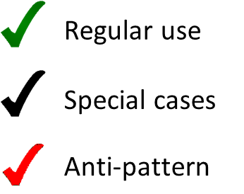

How to Configure helyOS Core as Backend
=======================================
To set up helyOS as the backend for a yard automation application, the developer needs to perform the following tasks:

1. Connect helyOS to a running rabbitMQ server.
2. Access the helyOS dashboard.
3. Register the frontend applications using the "Register App" tab on the dashboard.
4. Define the yard within the “Yards” tab on the dashboard. A yard is the enclosed area that houses the autonomous agents, such as vehicles or robots.
5. Register the agents (vehicles or robots) in the "Register Agents" dashboard tab. 
6. Specify the missions applicable to your application via the dashboard’s “Define Missions” menu. Examples of missions. *"drive_from_a_to_b"*, *"seed_field"*, etc.
7. Register microservices in the "Microservices" view. They will be used to process the mission's request data and produce assignment data, e.g. a trajectory path for the vehicle.
8. Create "Mission Recipes", that is, associate each mission to one or more of the registered microservices.

  By using helyOS core as a backend, front-end developers can create the user interface (e.g. Graphana boards, web applications, etc.). 
  They may use either **helyOS JavaScript SDK**  (for web applications) or the **GraphQL** language (for any kind of application) to create missions and access all data from the yard and the automated vehicles.

Implementation of a Yard Automation Application
===============================================

helyOS core is a single NodeJS application serving ports 5000 (GraphQL), 5002 (WebSocket) and 8080 (Dashboard).
helyOS connects as a client to Postgres and RabbitMQ. All parameters for these connections are passed as environment variables.

Since helyOS is containerized, it is easy to launch a helyOS application in the cloud. Users can either run the container inside a single Linux or Windows computer of a cloud provider, or they can implement helyOS in a serverless approach using available cloud products with horizontal auto scaling.

.. figure:: ./img/yard-application-framework.png
    :align: center
    :width: 600

    Typical application in helyOS framework

What is possible in the helyOS framework?
-----------------------------------------

The helyOS framework gives developers many options to solve yard automation problems. To better use this flexibility, the helyOS framework suggests a template to organize the data flow and the responsibilities of each domain. Following this template will lead to a more robust and maintainable software architecture.

.. figure:: ./img/helyos-framework-possibilities.png
    :align: center 
    :width: 700

