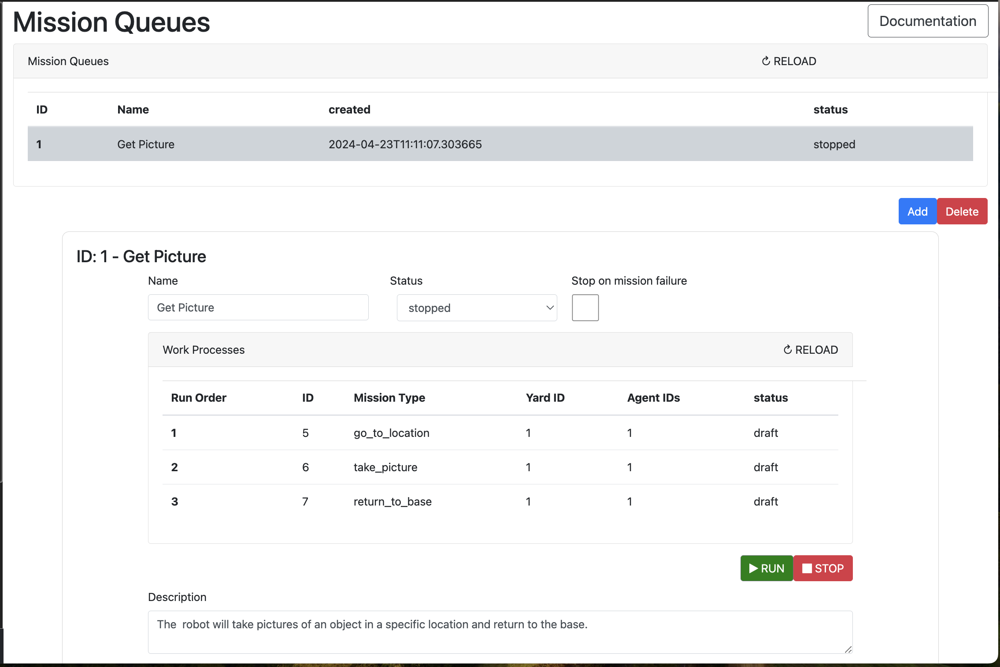

Requesting Missions
===================

To trigger a mission in helyOS core, a new instance of the `WorkProcess` must be created. 
The `WorkProcess`  is a generic process entity that can be used to create any kind of mission. 

The `WorkProcess` has the following fields:

- `id`: The unique identifier of the mission.
- `status`: The status of the mission: `draft`, `dispatched`, `executing`, `succeeded`, `failed`, `canceling`, `canceled`.
- `workProcessTypeName`: The type of the mission or the name of the mission recipe. The type of the mission is defined by the `WorkProcessType`.
- `data`: The data of the mission. The data of the mission is a JSON object that contains the parameters of the mission.
- `agentIds`: The agents that are assigned to the mission. The agents are defined by the `Agent` type.

To ensure that the mission is executed correctly, the `WorkProcess` must be created with the following status:

- `draft`: The mission is created but not dispatched. This state is useful to save the mission in the database and make modifications before dispatching, or to add it to a `MissionQueue`. To dispatch the mission, the status must be changed to `dispatched`. 

- `dispatched`: As soon as a `WorkProcess` is created with the status `dispatched`, or the status of a `WorkProcess` is changed to `dispatched`, helyOS will trigger a series of events to execute the mission. These events include the reservation of the agents, the calls to relevant microservices, and finally the dispatch of assignments to the agents. 

.. _handling_missions:

Handling the Mission Execution
==============================

While the mission assignments are being actively executed, the status of the `WorkProcess` will be `executing`. If one of the mission assignments fails, the status of the `WorkProcess` will be `failed`. 
If all the mission assignments succeed, the status of the `WorkProcess` will be `succeeded`.

If the client application wants to cancel the mission, the status of the `WorkProcess` must be changed to `canceling`. 
This will trigger the canceling of all pending microservice requests, the canceling of all running and pending assignments, and it will signal 
the release of all agents from the mission. Only after the succession of all these events, the `WorkProcess` will be automatically changed to `canceled`.

Reguarding the state flow of the `WorkProcess`, the client application should not forcefully change the status of the `WorkProcess` to `executing`, `succeeded`, `failed`, or `canceled`. Usually we have the following state flow:

- The `dispatched` is automatically changed to `executing` or `failed`.

- The `executing` is automatically changed to `succeeded` or `failed`.

- The `canceling` is automatically changed to `canceled`.

.. note:: 
    In principle, you can cancel an individual assignment by changing is status to `canceling`, this will result in a cancel instant action sent directly to the agent. However, this may 
    lead to an inconsitent state of the mission, therefore is recommended to cancel the mission, as described above, rather than cancel individual
    mission assignments.

Working with Mission Queues
==============================

External applications connected exclusively to the helyOS core are inherently limited in their ability to directly modify ongoing missions.
They can either make adjustments to an ongoing mission via `instant actions` (:ref:`instant_actions`) or  cancel the mission entirely.

Substantial modifications to an ungoing mission must be considered in advance when defining the microservices orchestration or programming actors that react to the mission within the autonomous domain.

However, for developers seeking flexibility in modifying complex missions from external applications, an alternative approach involves redefining these missions as a series of simpler missions and organizing them within a `MissionQueue`

For example, consider the scenario where a robot must to capture images of an object at a designated location. Such  mission could be  redefined as three simple missions: "go_to_location", "take_picture", "return_to_base".

The developer would create the MissionQueue "Get Picture", create the three `WorkProcess` entities with the status `draft`, and associate them to the "Get Picture" queue, via the `queue_id` property.

As soon the MissionQueue status is changed from **stopped** to **run**, the helyOS core will dispatch the missions in the specified order. 
This allows the application user the ability to pause, resume, add, or substitute subsequent missions in the queue,  providing greater autonomy over mission execution.

