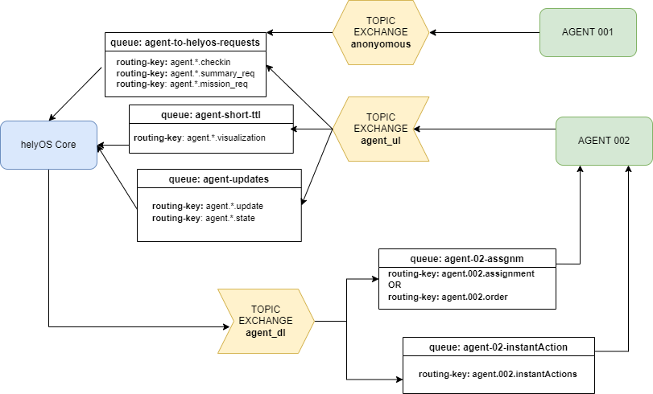
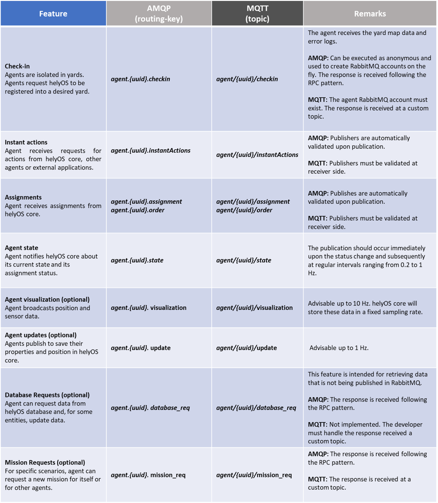
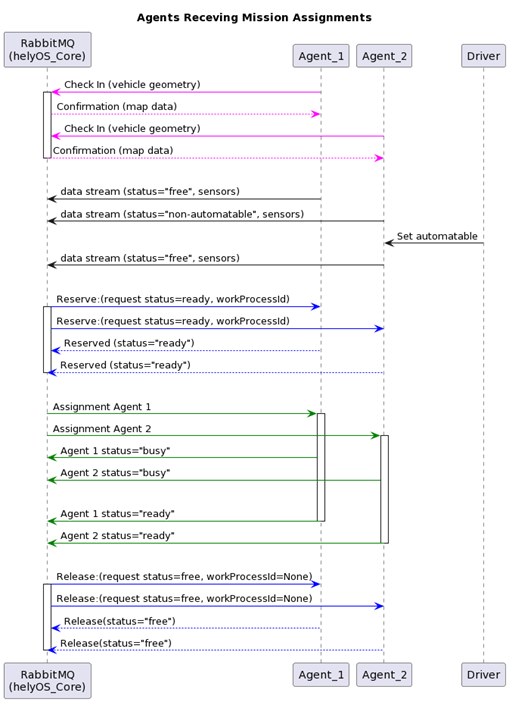
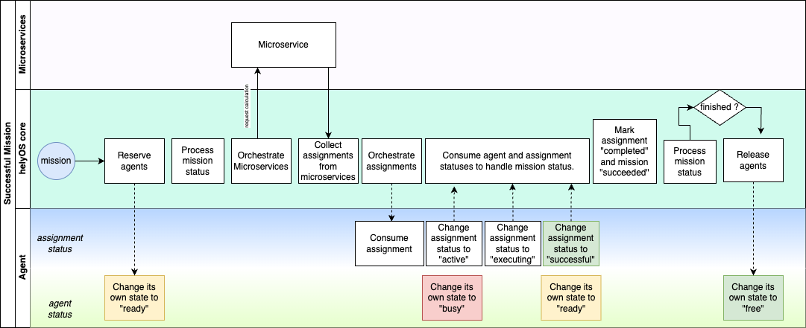
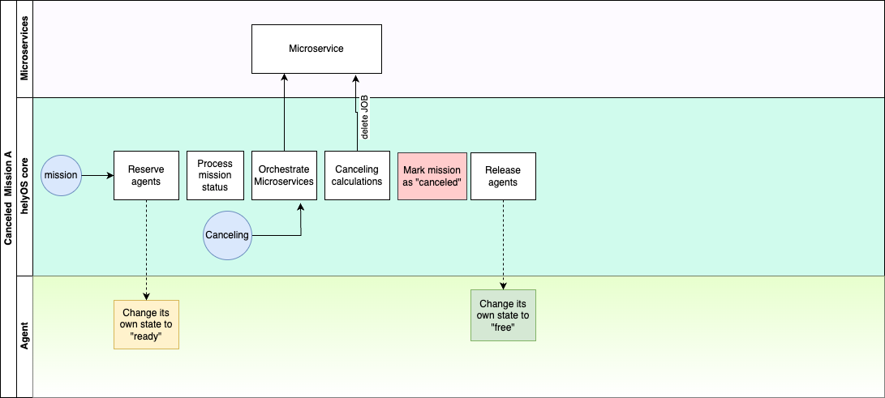
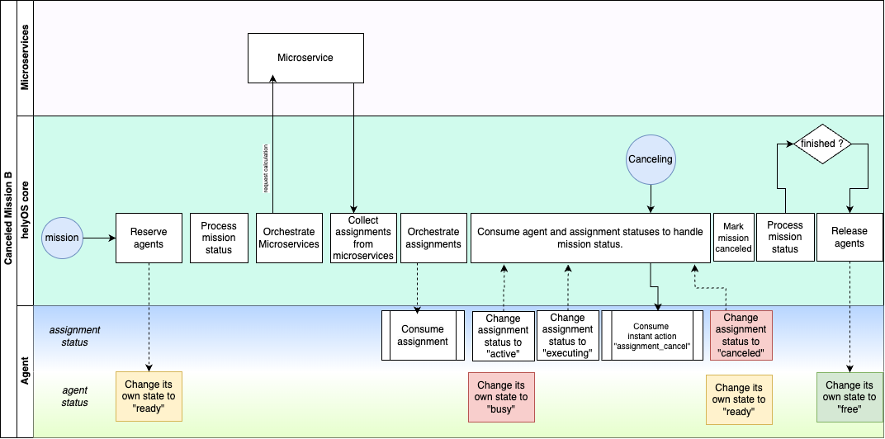

Exchange, Routing-keys and Queues in RabbitMQ
---------------------------------------------

    helyOS and rabbitMQ

Thanks to the RabbitMQ routing features, any RabbitMQ client subscribing to the topic exchange *agent_ul* can get the messages filtered by  routing-keys. 

Routing-keys
^^^^^^^^^^^^^
The agents will address their messages to the following routing-keys: 

- **agent.{uuid}.checkin** : used only for check-in data.
- **agent.{uuid}.update** : messages related to updates of agent properties. e.g., vehicle name, geometry data.
- **agent.{uuid}.visualization** : messages reporting the positioning and sensor data. 
- **agent.{uuid}.state** : messages reporting the assignment status and agent state.
- **agent.{uuid}.mission_req** : messages to request missions from helyOS.
- **agent.{uuid}.factsheet** : (included for compatibility with VDA5050) messages to report geometry.

The agents will receive messages from the following routing-keys: 

- **agent.{uuid}.assignment**: receive assignments.
- **agent.{uuid}.instantActions** : receive instant action commands from helyOS core or any other RabbitMQ client.

The additional routing-key is used to quickly updates map objects:
- **yard.{uuid}.visualization** : { 'map_object': {..} } or {'map_objects': [{..},{,,}] }

Routing-keys can be converted to topics for MQTT clients. Check the table below.

.. list-table:: Feature Comparison
   :widths: 15 20 20 45
   :header-rows: 1

   * - **Feature**
     - **AMQP (routing-key)**
     - **MQTT(topic-name)**
     - **Remarks**
   * - Check-in
     - agent.{uuid}.checkin
     - agent/{uuid}/checkin
     - The agent receives the yard map data and error logs.
       - AMQP: Can be executed as anonymous and used to create RabbitMQ accounts on the fly. The response is received following the RPC pattern.
       - MQTT: The agent RabbitMQ account must exist. The response is received at a custom topic.
   * - Check-out
     - agent.{uuid}.checkout
     - agent/{uuid}/checkout
     - The agent receives error logs.
       - AMQP: The agent RabbitMQ account must exist. The response is received following the RPC pattern.
       - MQTT: The agent RabbitMQ account must exist. The response is received at a custom topic.
   * - Instant actions
     - agent.{uuid}.instantActions
     - agent/{uuid}/instantActions
     - Agent receives requests for actions from helyOS core, other agents or external applications.
       - AMQP: Publishers are automatically validated upon publication.
       - MQTT: Publishers must be validated at receiver side.
   * - Assignments
     - agent.{uuid}.assignment
     - agent/{uuid}/assignment
     - Agent receives assignments from helyOS core.
       - AMQP: Publishes are automatically validated upon publication.
       - MQTT: Publishers must be validated at receiver side.
   * - Agent state
     - agent.{uuid}.state
     - agent/{uuid}/state
     - The publication should occur immediately upon the status change and subsequently at regular intervals ranging from 0.2 to 1 Hz.
   * - Agent visualization (optional)
     - agent.{uuid}.visualization
     - agent/{uuid}/visualization
     - Advisable up to 10 Hz. helyOS core will store these data in a fixed sampling rate.
   * - Agent updates (optional)
     - agent.{uuid}.update
     - agent/{uuid}/update
     - Advisable up to 1 Hz.
   * - Database Requests (optional)
     - agent.{uuid}.database_req
     - agent/{uuid}/database_req
     - This feature is intended for retrieving data that is not being published in RabbitMQ.
       - AMQP: The response is received following the RPC pattern.
       - MQTT: Not implemented. The developer must handle the response received at a custom topic.
   * - Mission Requests (optional)
     - agent.{uuid}.mission_req
     - agent/{uuid}/mission_req
     - For specific scenarios, agent can request a new mission for itself or for other agents.
       - AMQP: The response is received following the RPC pattern.
       - MQTT: The response is received at a custom topic.

Note that only if the agent's uuid is registered in the helyOS database, the agent can exchange messages with helyOS core to report
its status and to perform the assignments. 

Messages
^^^^^^^^^

All messages exchanged between helyOS and the agents include the following common fields:

- **type:** string, ex: "checkin", "assignment", "cancel", etc..
- **uuid:** string, the identification of the agent the message is about.
- **body:** JSON object.

The additional field **metadata** is present for some messages.

type
""""

    The values for message types defined by the helyOS framework are:

    **From Agent:**

    - **mission_request:** Messages where an agent requests a mission from helyOS.
    - **agent_state:** Messages reporting the agent's state.
    - **agent_sensors:** Messages reporting sensor data from the agent.
    - **agent_update:** Messages related to updates of agent properties.
    - **checkin:** Messages used only for check-in data.
    - **data_request**: Message used to request data from helyOS core database.

    **To Agent:**

    - **assignment_execution:** Messages to execute an assignment.
    - **assignment_cancel:** Instant action messages to cancel an assignment.
    - **reserve_for_mission:** Instant action messages to reserve the agent for a mission.
    - **release_from_mission:** Instant action messages to release the agent from a mission.
    - **custom_action:** Instant action messages to perform a custom action.

    Each type of message should be published to the specific routing_key.

uuid
""""
    The identifier of the agent to which the message pertains. 
    This value should match the RabbitMQ username for the agent. 
    An exception is when one agent is authorized to publish data on behalf of another agent in a leader-follower configuration. 
    For example, a tractor might publish positional data for the trailer it is pulling.

body
""""

    The **body** field will be specific for each message type. The easiest way to communicate to helyOS is to use the agent SDK connector methods: *publish_general_updates*, *publish_states* and *publish_sensors*. Ref: `Documentation <https://fraunhoferivi.github.io/helyOS-agent-sdk/build/html/apidocs/helyos_agent_sdk.connector.html#module-helyos_agent_sdk.connector>`_ and `Examples <https://fraunhoferivi.github.io/helyOS-agent-sdk/build/html/examples/index.html>`_

|

Code Examples
-------------

You can connect an agent to helyOS via any RabbitMQ or MQTT client using Python, Java, .Net, Ruby, JavaScript, Go, C and C++.
Here, we bring some examples of connection using Pyhton clients.

**AMQP**

.. code:: python

    import pika
    from my_agent import sensor_json_str, properties_json_str, states_json_str, mission_request_json_str
    from my_callbacks import ia_callback, as_callback

    # connect to RabbitMQ
    hostname ='rabbitmq.server.de'
    username = "134069fc5-fdgs-434b-b87e-f19c5435113"
    UPLINK = "xchange_helyos.agents.ul"; DOWNLINK = "xchange_helyos.agents.dl";

    credentials = pika.PlainCredentials(username, 'secret_passwd')
    sender_validation = pika.BasicProperties(user_id = username)
    parameters = pika.ConnectionParameters(hostname,  5672,credentials=credentials)
    connection = pika.BlockingConnection(parameters)
    channel = connection.channel()

    # publish sensors and position - can be performed up to 1000 Hz
    channel.basic_publish(UPLINK,"agent.134069fc5-fdgs-434b-b87e-f19c5435113.visualization", sensor_json_str, sender_validation)

    # update propeties as geometry and position - can be performed up to 10 Hz
    channel.basic_publish(UPLINK,"agent.134069fc5-fdgs-434b-b87e-f19c5435113.update", properties_json_str, sender_validation)

    # update agent and assignment status - must be performed immediately when the status change. Up to 2 Hz
    channel.basic_publish(UPLINK,"agent.134069fc5-fdgs-434b-b87e-f19c5435113.state", states_json_str ,sender_validation)

    # request a mission to helyOS
    channel.basic_publish(UPLINK,"agent.134069fc5-fdgs-434b-b87e-f19c5435113.mission", mission_request_json_str ,sender_validation)

    # receive instant actions
    channel.queue_declare(queue='ia_queue')        
    channel.queue_bind('ia_queue', DOWNLINK,"agent.134069fc5-fdgs-434b-b87e-f19c5435113.instantActions")
    channel.basic_consume('ia_queue', auto_ack=True, on_message_callback=ia_callback) 
        
    # receive order or assignments
    channel.queue_declare(queue='as_queue')        
    channel.queue_bind('as_queue', DOWNLINK, "agent.134069fc5-fdgs-434b-b87e-f19c5435113.assignment") # or ... .order
    channel.basic_consume('as_queue', auto_ack=True, on_message_callback=as_callback)   

    channel.start_consuming()

**Parse helyOS messages**

The following code can be used to parse any message from helyOS or the agent SDK:

.. code:: python

    def parse_any_helyos_agent_message(raw_str):
        # get message string
        object = json.loads(raw_str)
        message_str = object['message']
        message_signature = object['signature'] 
        # parse message string
        message = json.loads(message_str)
        print(f"message type: {message['type']}")
        print(f"message uuid: {message['uuid']}")
        print(f"message body: {message['body']}")
        print(f"message metadata: {message.get('metadata', None)}")

Tapping into the agent's data stream

.. code:: python

    import pika, json

    # connect to RabbitMQ
    hostname ='rabbitmq.server.de'
    username = "assistant-3432-434b-b87e-ds3245323"
    UPLINK = "xchange_helyos.agents.ul"

    credentials = pika.PlainCredentials(username, 'secret_passwd')
    parameters = pika.ConnectionParameters(hostname,  5672,credentials=credentials)
    connection = pika.BlockingConnection(parameters)
    channel = connection.channel()

    def parse_any_helyos_agent_message(raw_str):
        # get message string
        object = json.loads(raw_str)
        message_str = object['message']
        message_signature = object['signature'] 
        # parse message string
        message = json.loads(message_str)
        print(f"message type: {message['type']}")
        print(f"message uuid: {message['uuid']}")
        print(f"message body: {message['body']}")
        print(f"message metadata: {message.get('metadata', None)}")

    # Tapping into the agent's data stream - VISUALIZATION
    def tap_visualization_callback(ch, method, properties, raw_str):
        print("visualization data received")
        parse_any_helyos_agent_message(raw_str)

    channel.queue_declare(queue='visualization_queue')
    channel.queue_bind('visualization_queue', UPLINK, "agent.*.visualization")
    channel.basic_consume('visualization_queue', auto_ack=True, on_message_callback=tap_visualization_callback)

    # Tapping into the agent's data stream - STATE
    def tap_state_callback(ch, method, properties, raw_str):
        print("state data received")
        parse_any_helyos_agent_message(raw_str)

    channel.queue_declare(queue='state_queue')
    channel.queue_bind('state_queue', UPLINK, "agent.*.state")
    channel.basic_consume('state_queue', auto_ack=True, on_message_callback=tap_state_callback)

    # Tapping into the agent's data stream - UPDATE
    def tap_update_callback(ch, method, properties, raw_str):
        print("update data received")
        parse_any_helyos_agent_message(raw_str)
    
    channel.queue_declare(queue='update_queue')
    channel.queue_bind('update_queue', UPLINK, "agent.*.update")
    channel.basic_consume('update_queue', auto_ack=True, on_message_callback=tap_update_callback)

    channel.start_consuming()

**MQTT**

.. code:: python

    import paho.mqtt.client as mqtt
    # connect to RabbitMQ
    hostname ='rabbitmq.server.de'
    username = "134069fc5-fdgs-434b-b87e-f19c5435113"

    client = mqtt.Client()
    client.username_pw_set(username, 'secret_passwd')
    client.connect(rabbitmq_host, 1886)

    # publish sensors and position - can be performed up to 1000 Hz
    client.publish("agent/134069fc5-fdgs-434b-b87e-f19c5435113/visualization", sensor_json)

    # update propeties as geometry and position - can be performed up to 10 Hz
    client.publish("agent/134069fc5-fdgs-434b-b87e-f19c5435113/update", propeties_json)

    # update agent and assignment status - must be performed immediately when the status change. Up to 2 Hz
    client.publish("agent/134069fc5-fdgs-434b-b87e-f19c5435113/state", agent_assign_states_json)

    # receive instant actions
    client.subscribe("agent/134069fc5-fdgs-434b-b87e-f19c5435113/instantActions")
    client.message_callback_add("agent/134069fc5-fdgs-434b-b87e-f19c5435113/instantActions",ia_callback) 
        
    # receive order or assignments
    client.subscribe("agent/134069fc5-fdgs-434b-b87e-f19c5435113/assignment") # or ../order
    client.message_callback_add("agent/134069fc5-fdgs-434b-b87e-f19c5435113/assignment",as_callback) 

    client.loop_start()

These codes can be simplified by using the `helyos-agent-sdk`.
See examples also for AMQP and MQTT agents: https://fraunhoferivi.github.io/helyOS-agent-sdk/build/html/examples/index.html

|

Check in agent in helyOS
------------------------
To receive assignments from helyOS, the agent must perform a procedure called "check-in".

In the check-in procedure, the agent will 

- Connect to RabbitMQ and send its identification data.
- If the agent is connected as anonymous and possess the helyOS registration token, a new username and password will be automatically created.
- Create a temporary queue to receive the check-in response.

.. code-block:: typescript
    :caption: Check-in data sent by the agent to helyOS core. The symbol (?) means optional.

    CheckinCommandMessage {
        type: "checkin";

        uuid: string;

        body: {  
                yard_uid: string;         // yard the agent is checking in.
                status: string;
                pose: { x:number, y:number, z:number, orientations:number[]};
                type?: string;
                name?: string;
                data_format?: string;
                public_key?: string;
                geometry?: AnyDataFormat;
                factsheet?: AnyDataFormat
        }

    }

- **geometry:** JSON informing the physical geometry data of the vehicle.
- **yard_uid:** Unique identifier of the yard as registered in the dashboard.

helyOS will respond with the following data:

.. code-block:: typescript
    :caption: Check-in data sent by helyOS core to agent. The symbol (?) means optional.

    CheckinResponseMessage {
        type: "checkin";

        uuid: string;

        body: {  
                agentId: number;     // agent database id number
                yard_uid: string;   // yard the agent is checking in.
                status: string;
                map: {  uid:string, 
                        origin:{lat:number, lon:number, alt:number},
                        map_objects: MapObjects[]
                      };
                rbmq_username: string;
                response_code: string;
                helyos_public_key: string;
                ca_certificate: string;   // RabbitMQ server certificate for SSL connection
                rbmq_password?: string;  // When agent account does not exist in the RabbitMQ server.  
                password_encrypted? boolean              
        }

    }

- **type** = "check in".
- **map:** JSON with the map information from yard.
- **rbmq_username:** RabbitMQ account to be used by this agent.
- **rbmq_password:** RabbitMQ password, only used for anonymous check-in.
- **password_encrypted:** If true, the rbmq_password field is encrypted with the agent public key.

Check in using python code:

.. code:: python

    def checkin_pseudo_code(username, password):
        # step 1 - connect
        temporary_connection = connect_rabbitmq(rbmq_host, username, password)
        gest_channel = temporary_connection.channel()

        # step 2 - create a queue only to receive the check-in response
        checkin_response_queue = gest_channel.queue_declare(queue="")

        # step 3 - publish the check-in request
        uuid = "y4df7293-5aab-46e2-bf6b"
        publish_in_checkin_exchange_topic(yard_id=1, 
                                        uuid: uuid,
                                        routing_key: f"agent-{uuid}-checkin,
                                        status="free",
                                        agent_metadata=data,
                                        reply_to= checkin_response_queue)    

        
        # step 4 - start to consume checkin_response_queue and get the response data
        if username == 'anonymous':
            new_username, new_password, yard_data = listen_checkin_response(checkin_response_queue)
            helyos_connection = connect_rabbitmq(rbmq_host, new_username, new_password)
        else:
            _, _, yard_data = listen_checkin_response(checkin_response_queue)
            helyos_connection = connect_rabbitmq(rbmq_host, username, password)

        return helyos_connection, yard_data

The similar code using `helyos-agent-sdk` python package:

.. code:: python

    from helyos_agent_sdk import HelyOSClient, AgentConnector

    helyOS_client = HelyOSClient(rbmq_host,rbmq_port, uuid="y4df7293-5aab-46e2-bf6b")
    if username!='anonymous':
        helyos_client.connect(username, password)
    helyOS_client.perform_checkin(yard_uid='1', agent_data=data, status="free")
    helyOS_client.get_checkin_result()

    helyos_connection = heylOS_client.connection

The `helyOS-agent-sdk` has many other methods to send and receive data from helyOS core in the correct data format. 
Check the documentation at https://fraunhoferivi.github.io/helyOS-agent-sdk/build/html/index.html.

Agent and Assignment Status Update 
----------------------------------

The agent plays a crucial role in the helyOS framework by reporting, besides its own status, the status of the assignment it is currently handling. 
This is done via the routing key, *agent.{uuid}.state*. 

Agent Status 
^^^^^^^^^^^^

- **not_automatable**: Indicates that the agent cannot be automated. This status might apply when it is in manual mode or when certain conditions prevent automation.
- **free**: The agent is available and not currently engaged in any assignment. 
- **ready**: The agent is reserved for a mission and waiting for an assignment. 
- **busy**: The agent is currently handling an assignment.

Assignment Status
^^^^^^^^^^^^^^^^^

- **active**: The assignment has been received by the agent and is being prepared to start. This status indicates that the assignment will begin execution soon.

- **executing**: The assignment is actively running. The agent is performing the specified task.

- **succeeded**: The assignment has successfully completed its execution. The agent achieved the desired outcome.

- **canceled**: The assignment was canceled by a request from the helyOS core.

- **aborted**: The assignment was canceled by a request from the agent itself. This might occur if the agent encounters unexpected issues during execution.

- **failed**: The assignment failed to complete successfully. This status indicates that the desired outcome was not achieved.

Internally, the helyOS core will change the status from **succeeded** to **completed**, meaning the finalization of the assignment within the mission context.

.. code-block:: typescript
    :caption: Message for status update.

    StatusUpdateMessage {
        type: "agent_state";

        uuid: string;

        body: {  
                status: AGENT_STATUS; 
                assignment: { id: number;
                              status: ASSIGNMENT_STATUS;
                              result: any;  // any data resulted from the assignment.
                              };
                resources: { operation_types_available?: string[],  // inform applications about agent capbilities 
                             work_process_id: number;
                             reserved: boolean;
                            }
        }

    }

Best Practices for Managing Status
^^^^^^^^^^^^^^^^^^^^^^^^^^^^^^^^^^

**Publish on Change**: Whenever the agent's status or the assignment's status changes (e.g., from "free" to "busy" or from "active" to "executing"), it should immediately published.

**Periodically Publish Agent Status**: Regularly publishing agent status updates at moderate frequencies (every one or two seconds) serves as a heartbeat signal. It informs the helyOS core that the agent is online and functioning well. This is especially important if the agent's sensors are not being periodically published in the `visualization` channel.

**Avoid Frequent Assignment Status Updates**: Unlike agent status, assignment status should be published only when it changes. Unnecessary publishing can create additional overhead in the orchestration of missions.

|

helyOS Reserves Agent for Mission
---------------------------------
Before processing a mission request, helyOS core will reserve the required agent(s). This is done via the routing key, *agent.{uuid}.instantActions*. helyOS requests the agent to be in **"ready"** status (status="ready" and reserved=True). During the assignment, the agent's status changes to **"busy"**.  After the assignment is complete, the agent updates its status from **"busy"** to **"ready"**. At this point, helyOS may release the agent, depending on the presence of any further assignments in that mission.
The release message is also delivered via instant actions.

.. code-block:: typescript
    :caption: Message for reserve and release agent for a mission.

    ReserveMessage {
        type: "reserve_for_mission";

        uuid: string;

        body: { work_process_id: number;  // mission id for which the agent is being reserved.
                reserved: true;
                operation_types_available?: string[]; // (optional) inform requested capbilities 
        }

    }

    ReleaseMessage {
        type: "release_from_mission";

        uuid: string;

        body: { work_process_id: number;
                reserved: false;
        }
    }

The agent reservation is important because: 

(i) Mission calculations can require considerable computational power and take several seconds. Therefore, the agent must remain available during this period and not be used by other tasks.

(ii) In some missions, multiple agents may need to perform sequential assignments. In such cases, one agent must be reserved to wait for the completion of assignments from another agent.

(iii) Some missions require unique tools or devices that may not be present at the required agent. Thus, ensuring the readiness of both the agent and its hardware for the specific assignment is important.

(iv) In the interest of security, heavy agents, even those set to automatable mode, should communicate their upcoming assignment visually or soundly to their surroundings. This feature allows anyone nearby to abort the assignment before it starts if deemed necessary.

However, in some scenarios, agents should not be blocked waiting for a mission calculation. 
Instead, they should either fail the mission if they become suddenly unavailable after the calculation is done, or queue the assignment
to be executed later.
For those scenarios, the developer must uncheck the option `Acknowledge reservation` on the `Register Agent` tab in the dashboard.

Typical Data Flow with Agent Reservation 
^^^^^^^^^^^^^^^^^^^^^^^^^^^^^^^^^^^^^^^^

    Agents receiving mission assignments

| Note that before receiving any assignment, the agent must be reserved for the assignment mission. That is, the agent changes the status from "free" to "ready" (i.e., ready for the mission) upon helyOS *Reserve* request. Once the agent finishes the assignment, the agent will not set its status from "busy" to "free", but to "ready". This is because helyOS may sent him a second assignment belonging to the same mission. For this reason, the agent must wait the "Release" signal from helyOS to set itself "free". 

|

helyOS Sends Assignment to Agent
--------------------------------
As earlier mentioned, the assignments usually originated from the microservices. 
That is, the microservices translate the requested mission in assignments: :ref:`helyos_assignment`.
The microservices  return the assignments to helyOS core, and  helyOS  distributes them to the agents.
This is done via the routing key *agent.{uuid}.assignments*. 

If the option `Acknowledge reservation` is checked, helyOS will send an assignment to the agent **only if the agent status is "ready"**.   

.. code-block:: typescript
    :caption: Assignment object data format. The field **metadata** is automatically generated by helyOS core.

    AssignmentCommandMessage {
        type: "assignment_execution";

        uuid: string;

        body: AnyDataFormat;

        metadata: {  
                    id: number,             // assignment id.
                    work_process_id: number, // mission id.
                    yard_id: number,
                    status: string,
                    context?: { dependencies: PreviousAssignments[]}
        }

    }

    

An easy-to-implement security mechanism is to check the identity of the assignment sender. This is an embedded feature of RabbitMQ when using AMPQ protocol. For example, if you want your agent to only execute assignments from helyOS core, you can filter assignments originated from the RabbitMQ account "helyos_core".

Canceling a Running Mission
---------------------------

Client applications can request the cancellation of a mission, as described in the section :ref:`handling_missions`. A mission may include one or several assignments distributed to multiple agents. When a mission is canceled, helyOS must inform each agent to cancel its respective assignments. This is accomplished by publishing an `assignment_cancel` instant action on *agent.{uuid}.instantActions*.

.. code-block:: typescript
    :caption: Message from helyOS core to the agent for canceling the assignment.

    CancelMessage {
        type: "assignment_cancel";

        uuid: string;

        body: AnyDataFormat; // currently not used.

        metadata: {  
                    id: number;             // assignment id.
                    work_process_id: number; // mission id.
                    yard_id: number;
                    status: string;
                    context?: { dependencies: PreviousAssignments[] }
        }
    }

Upon receiving the cancellation message, the agent must:

1. Initiate internal procedures to interrupt the assignment.
2. Publish the assignment status as **"canceled"**.
3. Update its status to "ready" or "free" based on the application's requirements.

This ensures a smooth and coordinated cancellation process across all agents involved in the mission.

Typical Data Flows with Mission Cancelation 
^^^^^^^^^^^^^^^^^^^^^^^^^^^^^^^^^^^^^^^^^^^^

    Successful Mission.

    Mission canceled before the assignment being dispatched.

    Mission canceled after the assignment being dispatched.

|

Agent Reports Position and/or Sensor Data
-----------------------------------------

Agents can publish their positions and sensor data. The format for sensor data is freely defined by the developer. 
If you do not have a sensor format, you can use the helyOS-native sensor format: :ref:`helyos_sensor_format`.

The published information is routed to *agent.{uuid}.visualization*,  placed in a low-priority queue, and may expire under high load conditions. 
The typical publish rate for sensors is recommended to be 10 Hz. A reasonable upper limit would be 100 Hz, but depending on the number of agents and available computational resources, this value can reach up to 1000 Hz.
You can adjust the upper message rate using the environment variable MESSAGE_RATE_LIMIT. Agents that surpass this limit are automatically disconnected from RabbitMQ.

helyOS core stores any incoming sensor data in an in-memory database. This in-memory data is broadcast via WebSocket to client applications at a fixed rate of 10 Hz.
Additionally, the in-memory data is periodically pushed to the helyOS persistent database, Postgres, during each DB_BUFFER_TIME period.

If the developer needs to ensure that each individual measurement directly updates the Postgres, they must publish using the routing key *agent.{uuid}.update*, but this should be done at low frequencies.

.. code-block:: typescript
    :caption: Message to publish position and sensor values.

    SensorUpdateMessage {
        type: "agent_sensors";

        uuid: string;

        body: {
            pose:    { x: number; y: number; z: number; orientations: number[] };
            sensors: AnyDataFormat;
        }
    }

|

Agent Requests a Mission 
------------------------

In addition to client apps, agents can also request missions from helyOS core. This is done via the routing key *agent.{uuid}.mission_req*.  This feature is useful for situations such as the following:

- A smart camera identify a new obstacle and requests a mission to update helyOS map by sending the position of a new obstacle.
- A tractor requests a mission to ask assistance of another agent for executing a task.
- A truck finds itself obstructed by a fixed obstacle, the truck requests a mission from helyOS to calculate a path away from this deadlock situation, or to contact a teleoperated driving service.

.. code-block:: typescript
    :caption: Message for request a new mission.

    MissionRequestMessage {
        type: "mission_request";

        uuid: string;

        body: { agent_uuids: string []; // List of agents required for the mission.
                yard_id: int,
                work_process_type_name: string,  // Defined the mission to trigger.
                data: any,   // the input data for the requested missiong
                status: 'dispatched' // immediately triggering of the mission.
        }

    }

- **agent_uuids:** : List of unique identifiers for agents required for the mission. The agent can also request a mission to itself.

- **yard_id**: Identifier for the yard where the mission is to be executed.

- **work_process_type_name**: Defines the type of mission to trigger. Values are specific to mission recipes.

- **data**: The input data required for executing the requested mission.

- **status: 'dispatched'**: Status of the mission, set to 'dispatched' to trigger the mission immediately.

Assistant Agents and Data Retrieval
-----------------------------------

In the helyOS framework, **assistant** agents are specialized agents that support other actuator agents in completing their assignments. 
They are capable to perform every function that a normal agent can, but unlike actuator agents, which typically represent physical robots or vehicles, assistant agents are usually algorithms or services that facilitate data exchange between the yard, agents, and the helyOS core.

Assistant agents play a crucial role in the helyOS ecosystem by providing computational intelligence, data processing, and decision-making capabilities that enhance the overall functionality of the system. 
They can perform tasks such as data analysis, optimization, scheduling, and predictive maintenance.

Data Retrieval from the helyOS Database
^^^^^^^^^^^^^^^^^^^^^^^^^^^^^^^^^^^^^^^^

Agents can access data from the yard by interacting with the helyOS database. 

One practical method for data retrieval is through direct requests via RabbitMQ using a routing key formatted as "agent.{uuid}.database_req". These requests require the specification of a response queue and follow the remote procedure call (RPC) approach by using the AMQP property `reply_to`.

The message data structure for queries is:

.. code-block:: typescript
    :caption: Message for request data from helyOS core

    MissionRequestMessage {
        type: "data_request";

        uuid: string;

        body: { query: string // query name,
                conditions:  dictionary // conditions to be matched
        }

    }

The message data for mutation is:

.. code-block:: typescript
    :caption: Message for request data from helyOS core

    MissionRequestMessage {
        type: "data_request";

        uuid: string;

        body: { mutation: string // name of the mutation.
                data:  dictionary // fields and values to be written.
        }

    }

Using the helyOS Agent SDK's `DatabaseConnector`, data retrieval is straightforward. The `DatabaseConnector` class handles the necessary RPCs using the AMQP protocol, connecting to a helyOS client and making requests to the helyOS database.

Below are the possible data requests that can be made using the `DatabaseConnector`:

- `allAgents`: Retrieve all agents, with optional conditions to filter the results.
- `allLeaders`: Obtain the leader connections for a specific agent, identified by UUID.
- `allFollowers`: Get the follower connections for a specific agent, identified by UUID.
- `allYards`: Fetch all yards, with optional conditions to filter the results.
- `allExecutingMissions`: Select all missions that are currently in an 'executing' state.
- `allAssignmentsByMissionId`: Retrieve all assignments associated with a specific mission ID.
- `allMapObjects`: Access all map objects, with optional conditions to filter the results.

Additionally, the `DatabaseConnector` can handle mutations to the database, such as:

- `createMapObjects`: Create many new map objects with specified data.
- `updateMapObjects`: Update many map objects with specific data.
- `deleteMapObjects`: Delete map objects based on provided conditions.
- `deleteMapObjectByIds`: Remove multiple map objects by their IDs.

These requests and mutations are processed by helyos core, which interacts with various services to perform the desired database operations and ensure real-time data consistency through the in-memory database service.

Assistant agents may utilize these data retrieval and mutation capabilities to assist actuator agents in navigating the yard, executing missions, and managing the operational environment effectively.

Ref: https://helyosframework.github.io/helyos_agent_sdk/build/html/apidocs/helyos_agent_sdk.database_connector.html#helyos_agent_sdk.database_connector.DatabaseConnector
