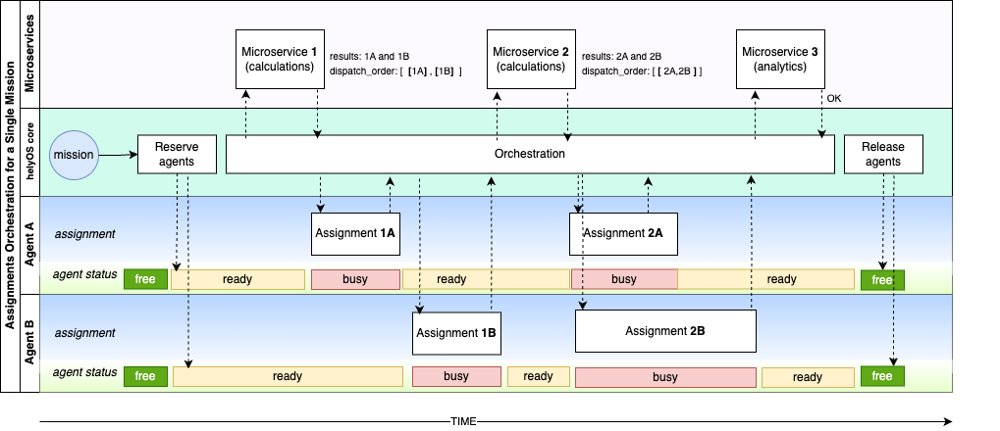
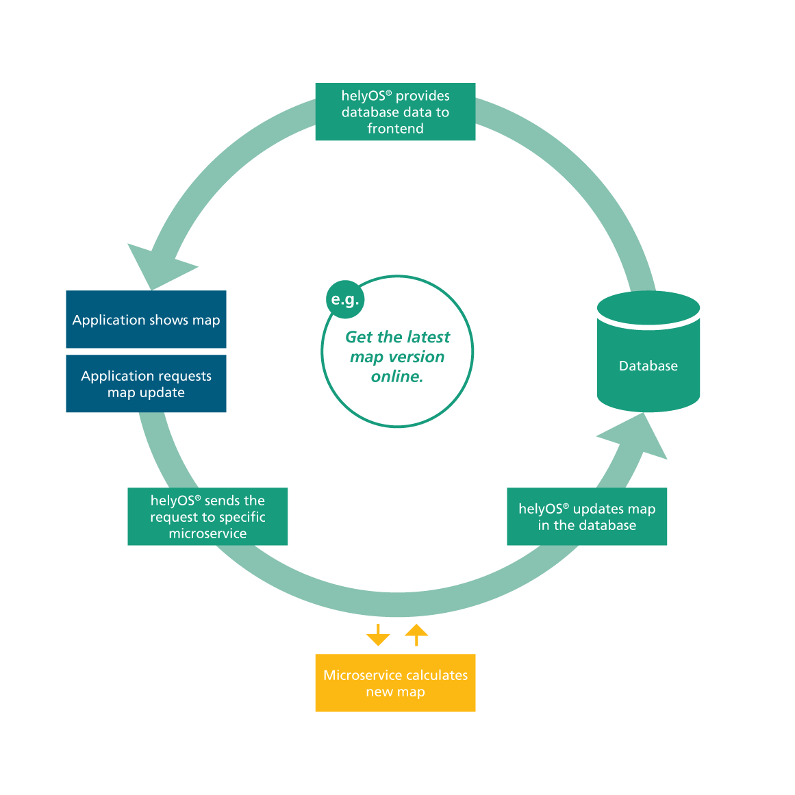
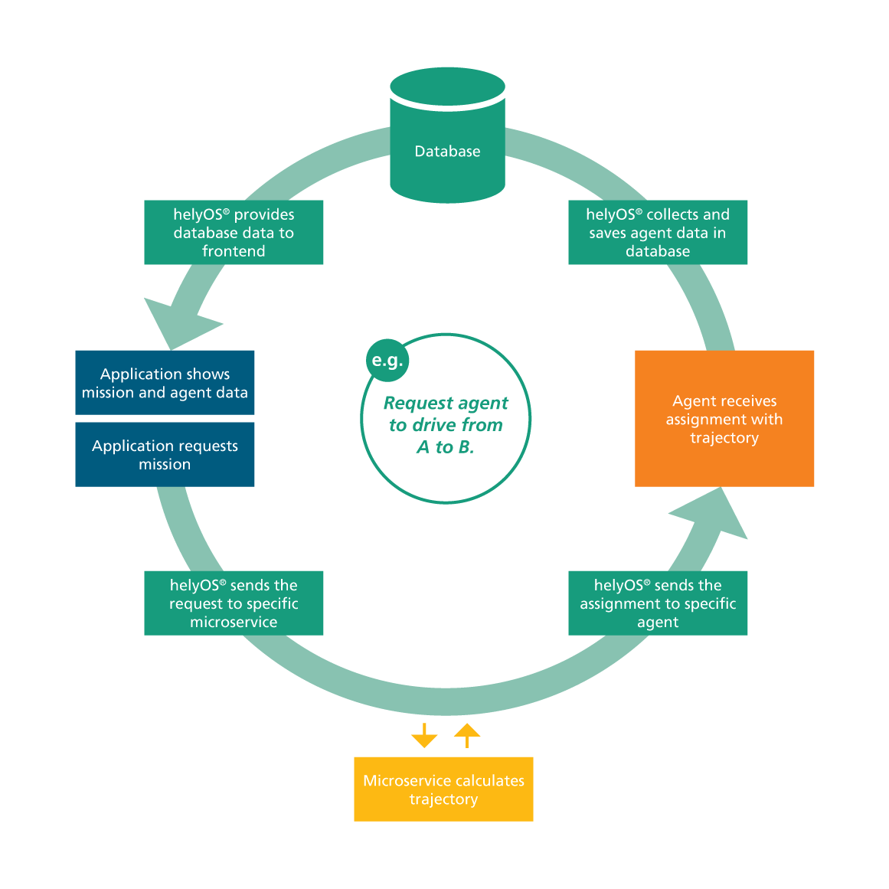
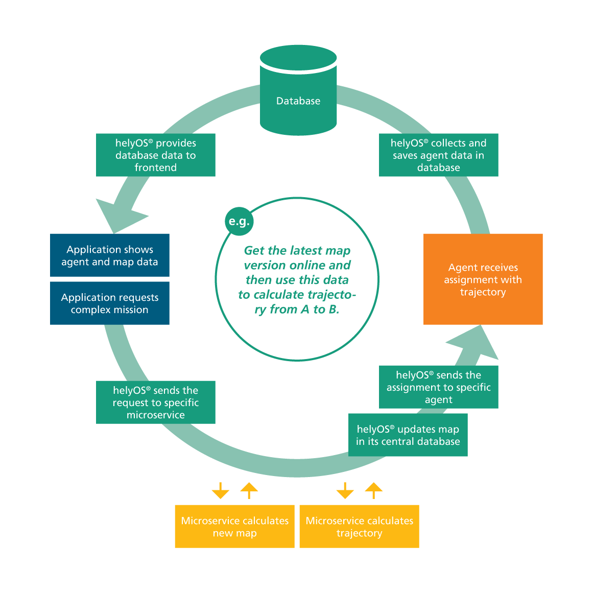
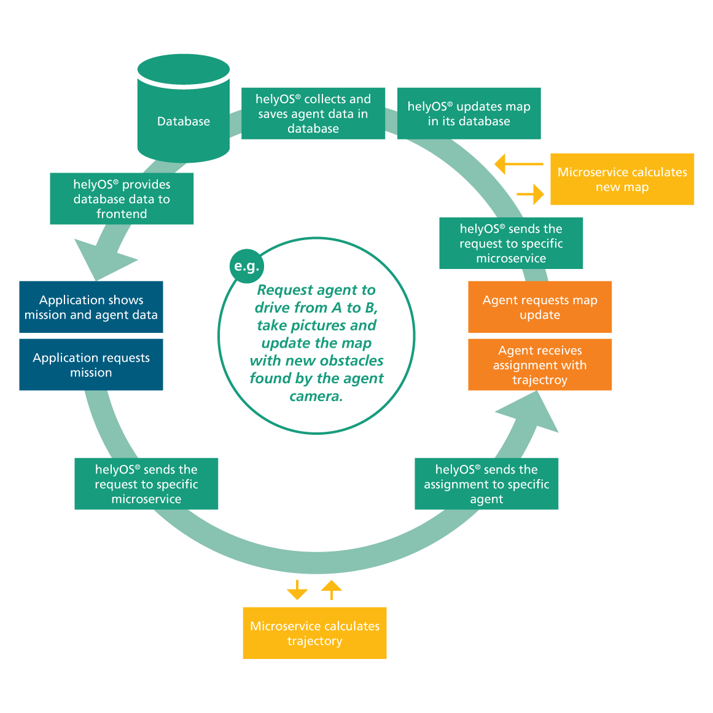

Complex Mission Orchestration
==============================

Consider a scenario where a mission commands two agents to collaborate on several assignments in a specific order. In this scenario, the calculation of the assignments must take into account the current yard state just before the assignment starts.

.. raw:: html

      

To acomplish this, we employed the following microservices: 

+--------------------------------+--------------------------------+--------------------------------+
|                                |                                |                                |
|.. literalinclude:: ms1.py      |.. literalinclude:: ms2.py      |.. literalinclude:: ms3.py      |
|     :caption:  Microservice 1  |     :caption:  Microservice 2  |     :caption:  Microservice 3  |
+--------------------------------+--------------------------------+--------------------------------+

Microservice 1 and 2 are `Assignmnent Planners`, while 3 is a `Storage Server`.
The microservice 1 produces two assignments that are executed sequentially by the agents.
The microservice 2 produces two assigments that are executed in parallel. The order of that the assignments are dispatched 
to the agents is defined within the microservice through  the property `dispatch_order`, you can read more about it in :ref:`fromMsToHelyOS`.

.. note:: 
    The Microservice 1 and 2 could also be merged into a single service which is called at two different steps in the mission. One can retrieve the mission recipe property `step` from the `context` and use as a parameter. The developer should decide the best approach taking into account the principle of separation of concerns, team responsabilities, etc.  

The order of that microservices are executed is defined by the misssion recipe: 

.. code:: yaml

    version: '2.0'

    missions:

        complex_mission:
            maxagents: 2
            description: "drive to multiple locations"
            on_assignment_failure: "FAIL_MISSION" 

            recipe:
                steps:
                    - step: "Microservice_1"
                      service_type: "drive"
                      request_order: 1
                      apply_result: true
                      override_config: "{}"

                    - step: "Microservice_2"
                      service_type: "imaging"
                      request_order: 2
                      apply_result: true
                      wait_assignments: true
                      dependencies: '["Microservice_1"]'

                    - step: "Microservice_3"
                      service_type: "statistics"
                      request_order: 3
                      wait_assignments: true
                      dependencies: '["Microservice_2"]'

Note that the `wait_assignments` property is set to `true`, meaning the calculation step will only start after the successful completion of all assignments produced in the previous step. Learn more at :ref:`mission-recipes-view`.

More Examples of Missions using helyOS
======================================
A. Application requests a map update.

B. Application requests truck to drive from A to B using an online path planner. 

C. Application requests truck to drive from A to B using an online path planner but employing the most recent map data in the path calculation. 

D. Application requests robot to take pictures and update the map objects.

